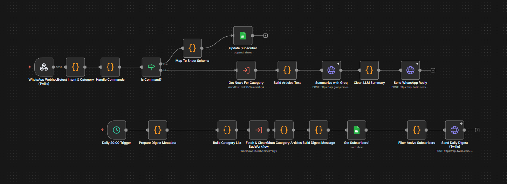

# WhatsApp AI Daily News Agent

An **AI-powered WhatsApp news agent** that delivers **real-time news on demand** and sends an **automated daily news digest at 20:00**.  
Built with **n8n, Twilio WhatsApp API, NewsAPI, and a Large Language Model**, with a **Next.js landing page deployed on Vercel**.

---

## 🚀 Features

- ✅ On-demand news via WhatsApp (e.g., `news tech`, `news sport`, `news economy`)
- ✅ Automated **daily news digest at 20:00**
- ✅ AI-generated **bullet-point summaries**
- ✅ Editorial style inspired by **France 24 / 2M**
- ✅ Real-time news fetched from a **public news API**
- ✅ Subscribe / unsubscribe to daily digest
- ✅ Deployed online with **Vercel + n8n Cloud**

---

## 🏗️ System Architecture

User (WhatsApp)
→ Twilio WhatsApp API
→ n8n Webhook
→ NewsAPI
→ AI Model (LLM)
→ WhatsApp Message to User

---

## 🧪 Supported Commands

digest on – Subscribe to daily news  
digest off – Unsubscribe from daily news 
news tech – Get latest technology news  
news sport – Get latest sports news  
news economy – Get latest economic news  
news world – Get world news  
news <topic> – Search news by custom topic  
 

---

## 🛠️ Tech Stack

- n8n Cloud – Workflow automation  
- Twilio WhatsApp API (Sandbox) – WhatsApp integration  
- NewsAPI – Real-time news data  
- Large Language Model (LLM) – News summarization  
- Next.js 14 – Landing page  
- React 18 + TypeScript  
- Tailwind CSS  
- Vercel – Hosting  

---

## 📂 Project Structure

WhatsApp_Daily_News.json → Main n8n workflow  
Fetch_And_Clean_News.json → Sub-workflow  
frontend/ → Next.js landing page  

This workflow handles:
- WhatsApp message reception via Twilio
- User command detection (`news`, `digest on`, `digest off`)
- Real-time news fetching
- AI summarization
- Automated daily news delivery at 20:00
---

## ⚙️ Prerequisites

- Node.js 14+
- Twilio Account with WhatsApp Sandbox enabled
- NewsAPI API Key
- n8n Cloud account
- A compatible LLM API key

---

## ▶️ Getting Started (Frontend)

git clone https://github.com/ChakirAmal/whatsapp_Daily_News.git  
cd whatsapp_Daily_News  
npm install  
npm run dev  

Then open:
http://localhost:3000

---

## ☁️ Deployment

Vercel (Frontend)
1. Push the project to GitHub  
2. Go to https://vercel.com  
3. Click New Project  
4. Select the repository  
5. Click Deploy  

n8n Cloud
1. Create an n8n cloud account  
2. Import the workflows  
3. Configure Twilio, NewsAPI and LLM credentials  
4. Activate both workflows  

---

## 📅 Daily News Automation

A Cron node in n8n automatically triggers every day at **20:00** to send the daily briefing.

---

## 📸 Demo

Live website: https://whatsapp-daily-news.vercel.app  
WhatsApp demo available via Twilio Sandbox  

---

## 🔮 Future Improvements

- Multi-language support (FR / EN / AR)
- User preference storage
- Topic personalization
- Admin dashboard
- Push notifications

---

## 👤 Author

Chakir Amal  
GitHub: https://github.com/ChakirAmal  
